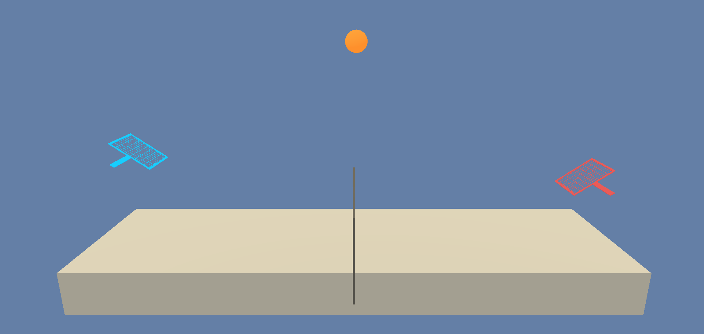

# DRL-Tennis

### Background
This project is part of the third assignment of the Udacity Deep Reinforcement Learning Nanodegree focused on Collaboration and Competition on multi-agent environments.

Here is a GIF with 20 seconds of the agents playing tennis after achieving a score of 0.5:

## Introduction
This project trains an agent to two agents control rackets to bounce a ball over a net, pretty much like a Tennis game.

Goal: Each agent needs to keep the ball in play.
Reward:
* +0.1 is provided if an agent hits the ball over the net
* -0.01 is penalized if an agent lets a ball hit the ground or hits the ball out of bounds

(Instructions taken and modified from Udacity's original version found [here](https://github.com/udacity/deep-reinforcement-learning/tree/master/p3_collab-compet))

The observation space consists of 8 variables corresponding to the position and velocity of the ball and racket. Each agent receives its own, local observation.

Given this information, the agents have to learn how to best select actions. Two continuous actions are available, corresponding to:

* movement toward (or away from) the net
* jumping

The task is episodic, and in order to solve the environment, your agents must get an average score of +0.5 (over 100 consecutive episodes, after taking the maximum over both agents). Specifically,
* After each episode, we add up the rewards that each agent received (without discounting), to get a score for each agent. This yields 2 (potentially different) scores. We then take the maximum of these 2 scores.
* This yields a single score for each episode.

The environment is considered solved, when the average (over 100 episodes) of those scores is at least +0.5.

## Getting Started

1. Clone this repository: '<https://github.com/mgmendoza/DRL-Tennis.git>'

2. Follow the instructions specified in README of the [Deep Reinforcement Learning Nanodegree](https://github.com/udacity/deep-reinforcement-learning#dependencies) to set your python environment. The instructions will also help you install OpenAI gym, PyTorch, and ML-agents which are packages required to run the project.  

3. The environment is already saved in this repository if you are using Windows (64-bit), If you are using another operating system you can download the environment from one of the links on the Getting Started section found [here](https://github.com/udacity/deep-reinforcement-learning/tree/master/p3_collab-compet))

4. Place the file in the DRLND GitHub repository, in the Environment/ folder, and unzip (or decompress) the file.

## Instructions
Follow the instructions in Play_tennis.ipynb to get started with training your own agent!

You should be able to watch your agents playing tennis like a "pro" in the last step.
