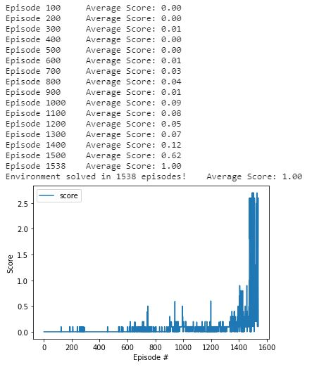

# Tennis Player Report

This report describes the details of the learning algorithm, its implementation, along with ideas for future work.

The high-level steps taken in training an agent following the '<Playing_tennis.ipynb>'

* Step 1: Importing packages and the Unity environment
* Step 2: Evaluate the state and action space
* Step 3: Establish baseline using a random action policy
* Step 4: Implement learning DDPG algorithm. In this case, the goal was to obtain a score >0.5 but this was extended to a higher score to improve performance
* Step 5: Loading the trained model into the environment to watch it perform. WARNING: more trial and error of hyperparameters will be done in the future. Even though the agents obtain the score needed, it needs high iterations to watch it perform as expected.

### Learning Algorithm & Code Structure :

The structure of how this repository was impleted is derived from my two other DRL-repo from the Deep Reinforcement Learning Nanodegree, specially [DRL-ContinousControl](https://github.com/mgmendoza/DRL-ContinousControl.git) and has been adjusted for the purpose of this project. This enviroment trained much faster using the same DDPG algorithm with some minor differences in the hyperparameters.

The code consists of :

* model.py : Here is where the Actor-Critic policy NN architectures are defined. There are two fully connected Deep Neural Network using the PyTorch Framework. It uses a forward neural netowrk architecture with reLu activation functions: '<fc1_units=128, fc2_units=128>.'

* ddpg_agent.py : Here is where the learning algorithm is implemented: 

You will start by specifying the Hyperparameters. Varying this parameters was larg part of the training:
```
BUFFER_SIZE  = int(1e5)        # replay buffer size
BATCH_SIZE   = 128             # minibatch size
GAMMA        = 0.99            # discount factor
TAU          = 1e-3            # for soft update of target parameters
LR_ACTOR     = 2e-4            # learning rate of the actor 
LR_CRITIC    = 2e-4            # learning rate of the critic
WEIGHT_DECAY = 0.0             # L2 weight decay
```
In ```class Agent():``` is where the agent interacts with and learns from the environment:

the _init_ function to interact and learn from the environment, this function will call the two Actor & Critic NN:

``` 
    def __init__(self, state_size, action_size, random_seed=42):
        """ 
        Params
        ======
            state_size (int): dimension of each state
            action_size (int): dimension of each action
            random_seed (int): random seed
        """
        self.state_size = state_size
        self.action_size = action_size
        self.seed = random.seed(random_seed)

        # Actor Network (w/ Target Network)
        self.actor_local = Actor(state_size, action_size, random_seed).to(device)
        self.actor_target = Actor(state_size, action_size, random_seed).to(device)
        self.actor_optimizer = optim.Adam(self.actor_local.parameters(), lr=LR_ACTOR)

        #copy weights from source to target network (part of initialization)
        for target, local in zip(self.actor_target.parameters(), self.actor_local.parameters()):
            target.data.copy_(local.data)

        # Critic Network (w/ Target Network)
        self.critic_local = Critic(state_size, action_size, random_seed).to(device)
        self.critic_target = Critic(state_size, action_size, random_seed).to(device)
        self.critic_optimizer = optim.Adam(self.critic_local.parameters(), lr=LR_CRITIC, weight_decay=WEIGHT_DECAY)

        #copy weights from source to target network (part of initialization)
        for target, local in zip(self.critic_target.parameters(), self.critic_local.parameters()):
            target.data.copy_(local.data)

        # Noise process
        self.noise = OUNoise(action_size, random_seed)

        # Replay memory
        self.memory = ReplayBuffer(action_size, BUFFER_SIZE, BATCH_SIZE, random_seed)
 
```
the _step_ function saves experience in replay memory, and use random sample from buffer to learn:
```
    def step(self, state, action, reward, next_state, done):
        # Save experience / reward
        self.memory.add(state, action, reward, next_state, done)

        # Learn, if enough samples are available in memory
        if len(self.memory) > BATCH_SIZE:
            experiences = self.memory.sample()
            self.learn(experiences, GAMMA)

```
the _act_ function returns actions for given state as per current policy, here we can call noise and gradient clipping
```
    def act(self, state, add_noise=True):
        state = torch.from_numpy(state).float().to(device)
        self.actor_local.eval()
        with torch.no_grad():
            action = self.actor_local(state).cpu().data.numpy()
        self.actor_local.train()
        if add_noise:
            action += self.noise.sample()
        return np.clip(action, -1, 1)

    def reset(self):
        self.noise.reset()


```
the _learn_ function to update value parameters and compute targets for current states, minimize losses and update target network
```
    def learn(self, experiences, gamma):
        """
        Q_targets = r + γ * critic_target(next_state, actor_target(next_state))
        where:
            actor_target(state) -> action
            critic_target(state, action) -> Q-value
        Params
        ======
            experiences (Tuple[torch.Tensor]): tuple of (s, a, r, s', done) tuples 
            gamma (float): discount factor
        """
        states, actions, rewards, next_states, dones = experiences

        # ---------------------------- update critic ---------------------------- #
        # Get predicted next-state actions and Q values from target models
        actions_next = self.actor_target(next_states)
        Q_targets_next = self.critic_target(next_states, actions_next)
        # Compute Q targets for current states (y_i)
        Q_targets = rewards + (gamma * Q_targets_next * (1 - dones))
        # Compute critic loss
        Q_expected = self.critic_local(states, actions)
        critic_loss = F.mse_loss(Q_expected, Q_targets)
        # Minimize the loss
        self.critic_optimizer.zero_grad()
        critic_loss.backward()
        torch.nn.utils.clip_grad_norm_(self.critic_local.parameters(), 1)
        self.critic_optimizer.step()

        # ---------------------------- update actor ---------------------------- #
        # Compute actor loss
        actions_pred = self.actor_local(states)
        actor_loss = -self.critic_local(states, actions_pred).mean()
        # Minimize the loss
        self.actor_optimizer.zero_grad()
        actor_loss.backward()
        self.actor_optimizer.step()

        # ----------------------- update target networks ----------------------- #
        self.soft_update(self.critic_local, self.critic_target, TAU)
        self.soft_update(self.actor_local, self.actor_target, TAU)
        
```
the _soft_ function updates the value from the target Neural Network from the local network weights (That's part of the Fixed Q Targets technique)

```
    def soft_update(self, local_model, target_model, tau):
        """
        θ_target = τ*θ_local + (1 - τ)*θ_target
        Params
        ======
            local_model: PyTorch model (weights will be copied from)
            target_model: PyTorch model (weights will be copied to)
            tau (float): interpolation parameter 
        """
        for target_param, local_param in zip(target_model.parameters(), local_model.parameters()):
            target_param.data.copy_(tau*local_param.data + (1.0-tau)*target_param.data)
```

Here we implement the Ornstein-Uhlenbeck process to generate the temporarilly correlated exploiration for efficiecy in control porblems with inertia, noise is introducted. 

* Futher explanation: Given that the set of actions are continuous and not discrete, exploration methods based on random uniform sampling would not yield the best results. This was an advantage that off-policy DDPG algorithm offers when treating the problem of exploration independently from the learning. More information found here: ["Continuous control with deep reinforcement learning"](https://arxiv.org/abs/1509.02971). Even though the paper suggests different hyperparameters that applied above, those did not perform well in my project. 


```
class OUNoise:

    def __init__(self, size, seed, mu=0., theta=0.15, sigma=0.1):
        """Initialize parameters and noise process."""
        self.mu = mu * np.ones(size)
        self.theta = theta
        self.sigma = sigma
        self.seed = random.seed(seed)
        self.reset()

    def reset(self):
        """Reset the internal state (= noise) to mean (mu)."""
        self.state = copy.copy(self.mu)

    def sample(self):
        """Update internal state and return it as a noise sample."""
        x = self.state
        dx = self.theta * (self.mu - x) + self.sigma * np.array([random.random() for i in range(len(x))])
        self.state = x + dx
        return self.state

```

In ```class ReplayBuffer():``` you will implement a fixed-size buffer to store experience tuples and it will allow to add an experience step to the memory and to  to randomly sample a batch of experience steps for the learning:

```
class ReplayBuffer:

    def __init__(self, action_size, buffer_size, batch_size, seed):
        """Initialize a ReplayBuffer object.
        Params
        ======
            buffer_size (int): maximum size of buffer
            batch_size (int): size of each training batch
        """
        self.action_size = action_size
        self.memory = deque(maxlen=buffer_size)  # internal memory (deque)
        self.batch_size = batch_size
        self.experience = namedtuple("Experience", field_names=["state", "action", "reward", "next_state", "done"])
        self.seed = random.seed(seed)
    
    def add(self, state, action, reward, next_state, done):
        """Add a new experience to memory."""
        e = self.experience(state, action, reward, next_state, done)
        self.memory.append(e)
    
    def sample(self):
        """Randomly sample a batch of experiences from memory."""
        experiences = random.sample(self.memory, k=self.batch_size)

        states = torch.from_numpy(np.vstack([e.state for e in experiences if e is not None])).float().to(device)
        actions = torch.from_numpy(np.vstack([e.action for e in experiences if e is not None])).float().to(device)
        rewards = torch.from_numpy(np.vstack([e.reward for e in experiences if e is not None])).float().to(device)
        next_states = torch.from_numpy(np.vstack([e.next_state for e in experiences if e is not None])).float().to(device)
        dones = torch.from_numpy(np.vstack([e.done for e in experiences if e is not None]).astype(np.uint8)).float().to(device)

        return (states, actions, rewards, next_states, dones)

    def __len__(self):
        """Return the current size of internal memory."""
        return len(self.memory)
```

Note that additional comment is found in the python code. 

* Playing_Tennis.ipynb : This Jupyter notebooks allows to import packages, examine environment, take random actions, train the agent using DDPG, visualize in unity when agents are training and after training, and the training performance in a plot. 

### Performance of the agent
After a lot of trial an error by changing hyperparemeters (see first section) and adding BATCHNORM1D in the NN architecture, I was able to obtain the following results:



### Ideas for Future Work
* Implement MADDPG and assess performance.
* Test performance of agent after training.
* Implement and compare with other algorithms that will perform better and train faster like Trusted Region Policy Optimization or Distributed Distributional Deterministic Policy Gradient.